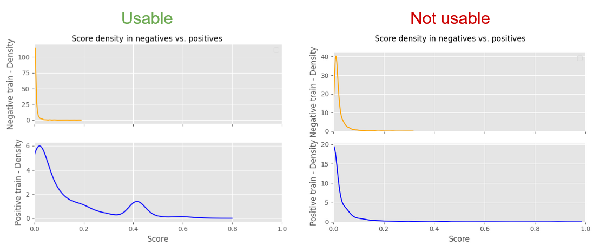

## Necessary files when extending DIGGER graphs based on PPIDM

Put the following files in here before running the code:
- `3did_flat` - downloaded from 3did.irbbarcelona.org
- `INTERACTION.txt` - from DOMINE
- `uniprot_sprot.dat` and `uniprot_trembl.dat` - downloaded from UniProt (it makes sense to just download 
the file for a single organism)
- ``pdb_chain_pfam.tsv`` - downloaded from ebi.ac.uk/pdbe/docs/sifts/quick.html
- ``mart_export.txt`` - downloaded from ensembl.org/biomart, be sure to include ``Gene stable ID``, 
``UniProtKB/Swiss-Prot ID``,``NCBI gene (formerly Entrezgene) ID`` as columns

## Evaluating not very good F1 scores in PPIDM

When running the PPIDM method, you will get an F1 score based on a testing set of known
interactions. If the F1 score is not above >0.8 you will be asked to confirm to continue
running the method since there is a possibility that you will get unreliable results.
To properly evaluate for your scenario whether you should continue or not, you should look at
the generated image called `score_density_{timestamp}.png`. This image shows the distribution
of scores in the negative training set as well as the positive training set given the best
found weights for each database. 

The negative train density should be very high at 0 and drop swiftly for any score above 0.
The overall density of the positive train should be much lower and ideally be a lot more 
distributed. The way PPIDM works is, that it tries to find a threshold that separates the
positive and negative interactions (i.e. 0.015). Any score above this threshold is considered
an interaction. Any score below this threshold is considered a non-interaction.

Therefore, if the positive train density is also very high at 0, then the model is not
able to distinguish well between positive and negative. In this case, you should
not continue. The below image shows two examples of density plots.

To alleviate this problem, you should add more databases to the PPIDM method. Since PPIDM
works by combining multiple databases, having more input databases will increase the 
available protein-protein interactions the method can use to learn from. For the human
data, eight different databases were used. Same goes for the mouse data.
You can also try to increase the number of parameters tested, however, the impact of this
will be quite small. 
